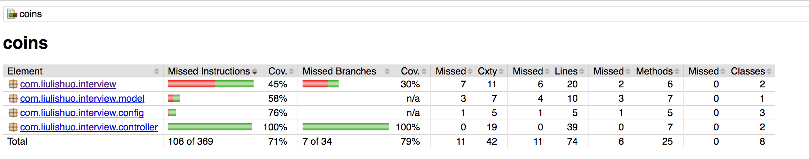

# 如何编译

```
mvn clean package
```

# 单测覆盖率



## 如何验证

首先执行

```
mvn verify
cd target/site/jacoco/ && python -m SimpleHTTPServer 8000
```

然后使用浏览器访问 http://127.0.0.1:8000。

# 如何使用

## 启停脚本

```
sh demo-project.sh {status|start|stop|restart}
```

## API

### 添加用户和金币

```
curl -X POST --data "user_id=1&coins=100" http://127.0.0.1:8080/user/add
```

### 给定用户ID, 返回当前金币金额

```
curl http://127.0.0.1:8080/user/1/coins
```

### 给定 from_user_id, to_user_id, 金额 X, 完成从 from_user_id 向 to_user_id 的账户转账 X 金币

```
curl -X POST --data "from_user_id=1&to_user_id=2&coins=500" http://127.0.0.1:8080/user/transfer
```
